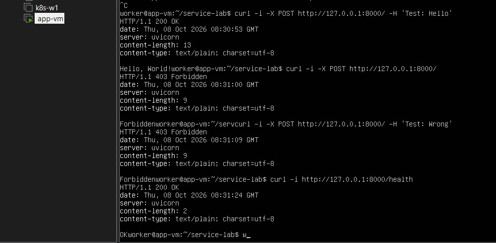
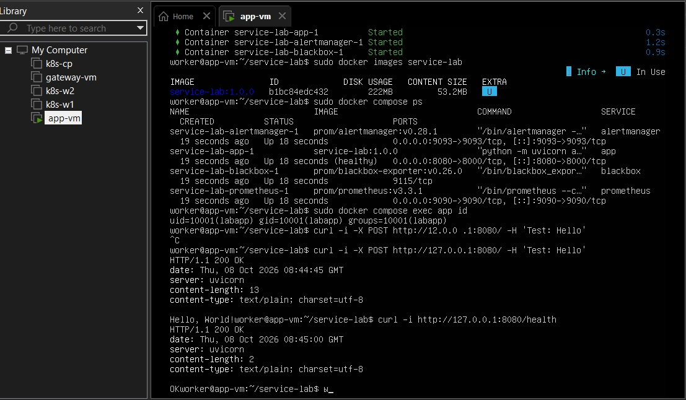
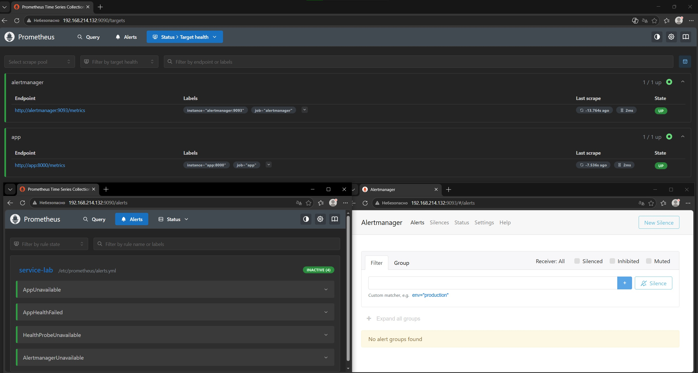
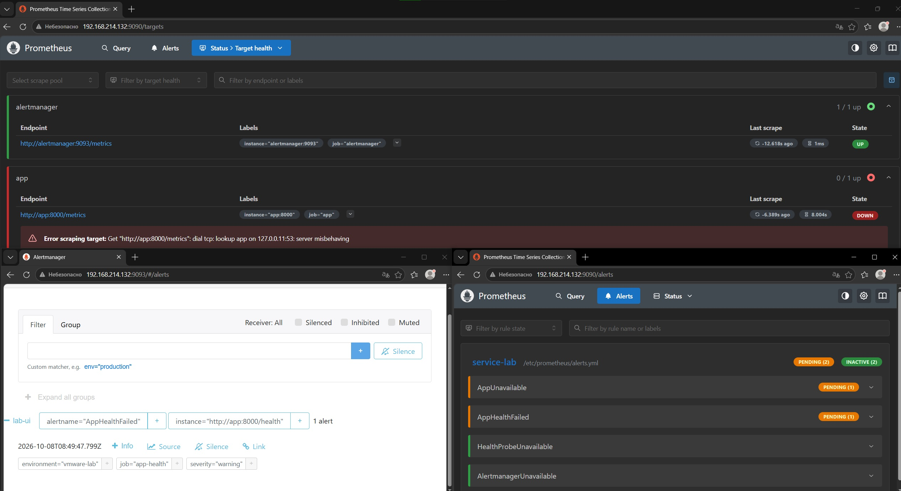
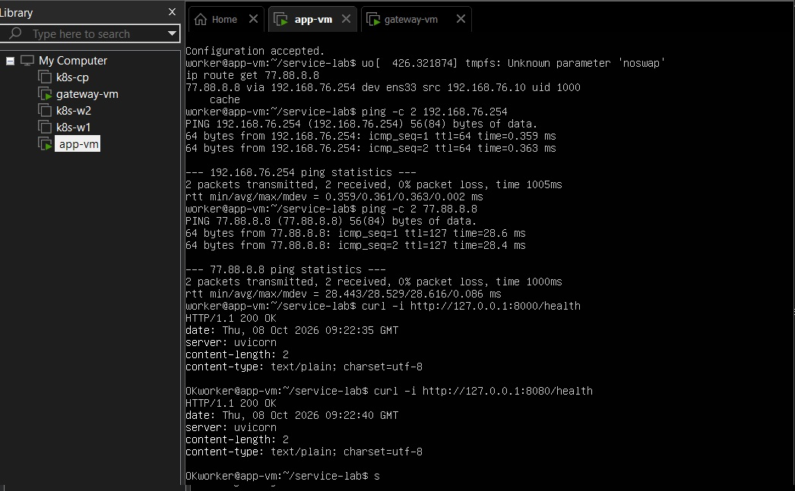
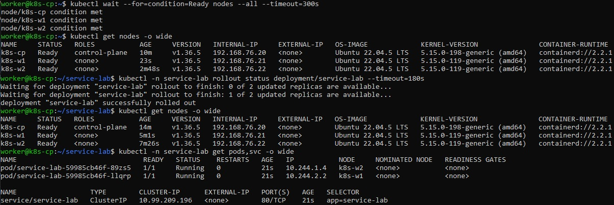
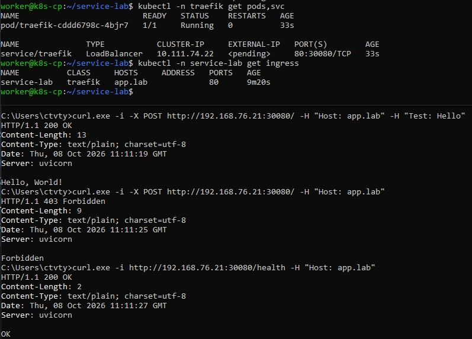

# 🚀 Service Lab

Тестовое задание: Python-приложение, запуск через systemd, Docker с мониторингом,
NAT-шлюз и Kubernetes с доступом через ingress.

**🧰 Стек:** Python · FastAPI · Docker Compose · Prometheus · Alertmanager · kubeadm · Flannel · Traefik  
**💻 Стенд:** VMware Workstation Pro · Ubuntu Server 22.04

> 📖 [Полная инструкция по развёртыванию](docs/SETUP.md)  
> 📸 Ниже оставлены места для моих скриншотов с результатами проверок.

## 🗺️ Схема стенда

| VM | Задача | IP |
| --- | --- | --- |
| app-vm | Приложение и мониторинг | `192.168.76.10` |
| gateway-vm | NAT-шлюз | `192.168.76.254` |
| k8s-cp | Control plane | `192.168.76.20` |
| k8s-w1 | Worker | `192.168.76.21` |
| k8s-w2 | Worker | `192.168.76.22` |

**VMnet1** - внутренняя сеть `192.168.76.0/24`, DHCP выключен.  
**VMnet8** - внешняя сеть шлюза, NAT VMware.  
Адрес Windows в VMnet1 - `192.168.76.1`. Шлюз внутренних VM - `192.168.76.254`.

Выход в интернет: **внутренняя VM → gateway-vm → NAT VMware → интернет**.

## ⚡ Основные команды

На `app-vm`, из папки проекта:

```bash
# Приложение через systemd
sudo bash scripts/install-systemd.sh

# Docker, проверка конфигов и запуск мониторинга
sudo bash scripts/install-docker.sh
sudo docker build -t service-lab:1.0.0 .
sudo bash scripts/verify-configs.sh
sudo docker compose up -d --build
```

systemd слушает порт **8000**, приложение в Docker доступно через **8080**.
Настройка сети и кластера по шагам - в [инструкции](docs/SETUP.md).

## 🧪 API - пункт a

| Запрос | Результат |
| --- | --- |
| POST `/`, заголовок `Test: Hello` | `200` · `Hello, World!` |
| POST `/`, заголовок отсутствует или неверный | `403` |
| GET `/health`, ping `77.88.8.8` успешен | `200` · `OK` |
| GET `/health`, ping не прошёл | `503` |
| GET `/metrics` | Метрики для Prometheus |

```bash
curl -i -X POST http://192.168.76.10:8000/ -H 'Test: Hello'
curl -i -X POST http://192.168.76.10:8000/
curl -i http://192.168.76.10:8000/health
```

📸 **На скриншоте:** успешный POST, отказ без заголовка и ответ `200 OK` от `/health`.



## 🐧 systemd - пункт b

Приложение запускается от отдельного системного пользователя `labapp`.
Код находится в `/opt/service-lab`, сервис включён в автозапуск.

```bash
sudo systemctl status service-lab --no-pager
sudo systemctl show service-lab -p User -p Group -p ActiveState
ps -eo user,pid,args | grep '[u]vicorn'
```

📸 **На скриншоте:** активный сервис и процесс от `labapp`.


## 🐳 Docker - пункт c

Образ - `service-lab:1.0.0`. Приложение внутри контейнера работает от UID `10001`.

```bash
sudo docker images service-lab
sudo docker compose ps
curl -i http://192.168.76.10:8080/health
```

📸 **На скриншоте:** собранный образ, запущенные контейнеры и ответ приложения.



## 📊 Мониторинг - пункт d

| Сервис | Адрес |
| --- | --- |
| Prometheus · цели | [192.168.76.10:9090/targets](http://192.168.76.10:9090/targets) |
| Prometheus · алерты | [192.168.76.10:9090/alerts](http://192.168.76.10:9090/alerts) |
| Alertmanager | [192.168.76.10:9093](http://192.168.76.10:9093) |

Prometheus собирает метрики. Blackbox Exporter проверяет `/health` каждые 15 секунд.
После минуты отказа срабатывает алерт, который передаётся в Alertmanager.

📸 **На скриншоте:** цели приложения и проверки `/health` в состоянии `UP`.



Для проверки алертов останови приложение:

```bash
sudo docker compose stop app
# После проверки восстанови его
sudo docker compose start app
```

Между остановкой и запуском подожди **1–2 минуты** и проверь алерты.
В этом стенде они отображаются в Alertmanager; email и Telegram не подключены.

📸 **На скриншоте:** алерты при остановленном приложении.



## 🌐 NAT - пункты d–e

У `gateway-vm` два интерфейса: WAN в VMnet8 и LAN в VMnet1.
Включены IP forwarding и masquerade через nftables.
У приложения остаётся один интерфейс в VMnet1, выход наружу идёт через шлюз.

Конфиги: [шлюз](network/gateway.yaml), [внутренняя VM](network/internal-node.yaml),
[правила NAT](network/nftables.conf).

Проверки на `app-vm`:

```bash
ip route get 77.88.8.8
ping -c 2 77.88.8.8
curl -i http://127.0.0.1:8000/health
```

📸 **На скриншоте:** маршрут через `192.168.76.254`, успешный ping и правила NAT шлюза.



## ☸️ Kubernetes - пункты f–g

Кластер: **1 control plane + 2 workers**, сеть Pod - Flannel.
Приложение разворачивается в namespace `service-lab` с двумя репликами.

Перед развёртыванием импортируй образ **на все три ноды** в containerd namespace
`k8s.io`. Команды установки кластера и переноса образа - в [инструкции](docs/SETUP.md).

На `k8s-cp`:

```bash
kubectl apply -f k8s/app.yaml
kubectl -n service-lab rollout status deployment/service-lab
kubectl get nodes -o wide
kubectl -n service-lab get pods,svc -o wide
```

📸 **На скриншоте:** три ноды `Ready`, две готовые реплики и Service приложения.



## 🚪 Ingress - пункт h

После установки Helm, на `k8s-cp`:

```bash
bash scripts/install-traefik.sh
kubectl -n traefik get svc
kubectl -n service-lab get ingress
```

Вход: **Windows → IP ноды:30080 → Traefik → Service → Pod**.
Маршрут выбирается по заголовку `Host: app.lab`. `port-forward` не используется.

Проверка из PowerShell Windows:

```powershell
curl.exe -i -X POST http://192.168.76.21:30080/ -H "Host: app.lab" -H "Test: Hello"
curl.exe -i http://192.168.76.21:30080/health -H "Host: app.lab"
```

📸 **На скриншоте:** Ingress, NodePort `30080` и успешные ответы с Windows.




## ✅ Проверка кода

```bash
python3 -m venv .venv
.venv/bin/pip install -r requirements-dev.txt
.venv/bin/python -m pytest -q
```

Проверены **17 тестов приложения** и shell-скрипты.
Скриншоты-заглушки не подтверждают запуск стенда: результаты VM, NAT и Kubernetes
добавляются после проверки на своих машинах.
